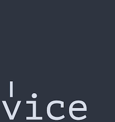

# Go channels at horizontal scale [](https://travis-ci.org/matryer/vice)

* Use Go channels transparently over a [messaging queue technology of your choice](https://github.com/matryer/vice/tree/master/queues) (Currently [NATS](http://nats.io), [Redis](http://redis.io) or [NSQ](http://nsq.io), [Amazon SQS](https://aws.amazon.com/sqs/))
* Swap `vice.Transport` to change underlying queueing technologies transparently
* Write idiomatic Go code instead of learning queue specific APIs
* Develop against in-memory implementation before putting it into the wild
* Independent unit tests (no need for running queue technology)

PROJECT STATUS: BETA - Aiming for v1.0 release in October 2017.

## Usage

This code receives names on the `|names|` queue, and sends greetings on the `|greetings|`
queue:

```go
// get a Go channel that will receive messages on the
// |names| queue
names := transport.Receive("names")

// get a Go channel that will send messages on the
// |greetings| queue
greetings := transport.Send("greetings")

// respond to |names| messages with |greetings|
for name := range names {
	greetings <- []byte("Hello " + string(name))
}
```

* The code above is illustrative, be sure to read the [design patterns](https://github.com/matryer/vice/blob/master/docs/design-patterns.md)
* Always stop the Transport, some technologies register and deregister their interest in the queues (this means trapping signals and gracefully shutting down services before exiting)
* Use `Send` and `Receive` methods to get channels, which you can then use as normal
* Be sure to always handle the `ErrChan()` error channel to make sure the underlying queue technology is healthy

## Quick start guide

* Write your services with unit tests using normal Go channels (see our [design patterns](https://github.com/matryer/vice/blob/master/docs/design-patterns.md))
* Install Vice with `go get github.com/matryer/vice/...`
* Select a [messaging queue technology](https://github.com/matryer/vice/tree/master/queues)
* Build a command to run your service

Read the blog post: [Introducing vice: Go channels across many machines](https://medium.com/@matryer/introducing-vice-go-channels-across-many-machines-bcac1147d7e2)

## Acknowledgements 

Special thanks go to [David Hernandez](https://github.com/dahernan), [Jason Hancock](https://github.com/jasonhancock) and [Piotr Rojek](https://github.com/piotrrojek) for their support on this project.
